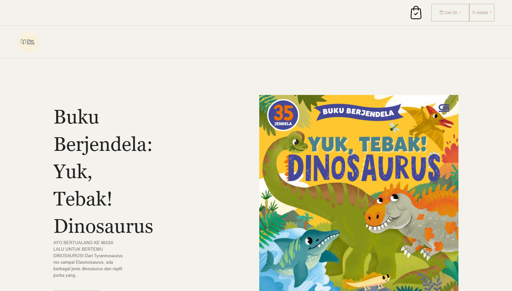
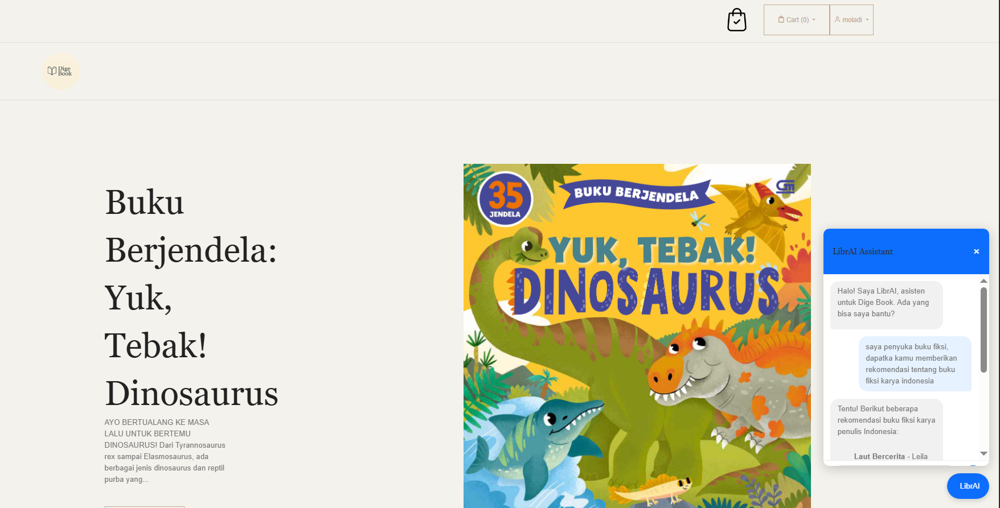

**Dige Book - E-Commerce Platform Documentation**


Aplikasi penjualan buku dengan fitur:
- ✅ Autentikasi User (Login/Register)
- ✅ Pencarian Buku dari API Eksternal
- ✅ Keranjang Belanja & Checkout
- ✅ Chatbot AI (LibrAI) untuk Bantuan Pelanggan

**🔧 INSTALASI**
Clone Repo:
```bash
git clone https://github.com/VickyOktafrian/DigeBook-APP.git
```
```bash
Install Dependencies:
composer install
npm install && npm run build
```
Setup .env:
```bash
DB_CONNECTION=mysql
DB_HOST=127.0.0.1
DB_DATABASE=nama_db
DB_USERNAME=root
DB_PASSWORD=
OPENROUTER_API_KEY=key_anda
```

Jalankan:
```bash
php artisan migrate --seed
php artisan serve
```

**🔐 API DOCUMENTATION**
1. AUTENTIKASI

Register
```bash 
POST /api/register
Body: { "name": "John", "email": "john@mail.com", "password": "password", "password_confirmation": "password" }
Response: { "token": "1|abc123" }
```

Login
```bash
POST /api/login
Body: { "email": "john@mail.com", "password": "123" }
```
```bash
Response: { "token": "1|abc123" }
```

2. BUKU
```bash
GET /api/books
```
```bash
Response: [ { "id": 1, "title": "Laravel Book", "price": 50000 } ]
```

3. KERANJANG
Add to Cart (Butuh Token)
```bash
POST /api/cart/add
Headers: { "Authorization": "Bearer 1|abc123" }
Body: { "book_id": 1, "quantity": 2 }
```
4. ORDER
```bash
Checkout (Butuh Token)
POST /api/checkout
```
```bash
Response: { "order_id": 123, "total": 100000 }
```

🖼 SCREENSHOT
Homepage: ,


📝 CATATAN
Gunakan token dari response login untuk akses API protected.

API Key OpenRouter wajib diisi di .env.